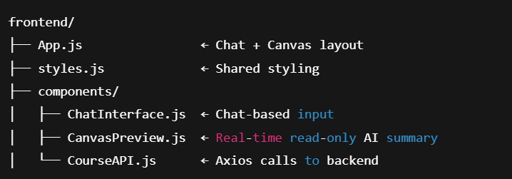

### run the backend:
```uvicorn main:app --reload```

### run the frontend:
```npm start```

## what does the app do?
- AI generates the overview
- User edits any field
- Sends edited object to /revise_course
- LLM rewrites it with context — keeping user’s intent


## Project Structure
- Route file in ```routes/```
- Prompt logic in ```services/```
- Model schema in ```models/```



✅ Start with a course form

Input: name, desc, duration, hours

Output: first course overview (same as before)

🧾 Canvas on right side gets populated with generated overview

💬 Chat below the form or beside the canvas

Lets the user iteratively refine the overview via chat

All edits update the canvas only (no input fields)